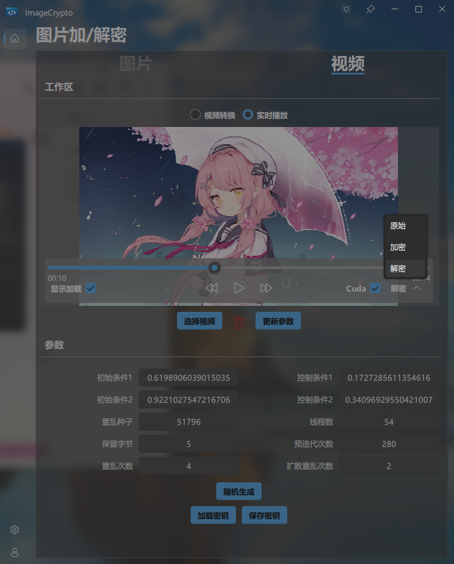
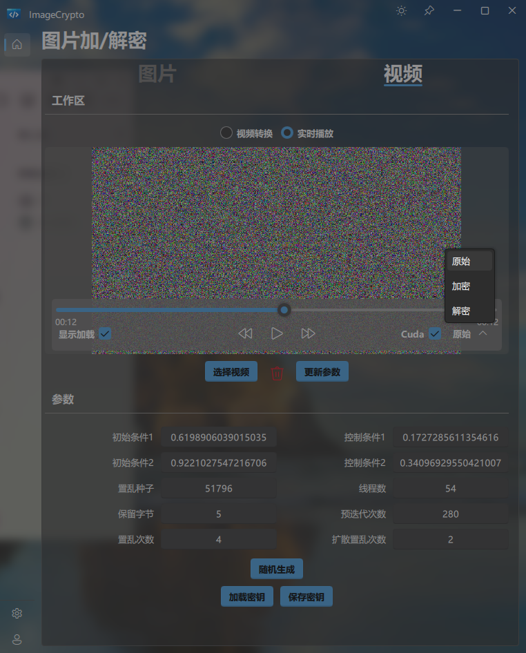

# image_en_decrypto

## ScreenShots
### Windows 10

### Ubuntu 24.04

### MacOS 15

## Cuda
[Cuda Support Module](./Core/include/private/Cuda.cuh)

## C++
[Semaphore](./Core/SubModules/Semaphore)

[Mutex](./Core/SubModules/Mutex)

[RWLock](./Core/SubModules/RWLock)

[ConditionVariable](./Core/SubModules/ConditionVariable)

[Bitmap](./Core/SubModules/Bitmap)

[ThreadPool](./Core/SubModules/ThreadPool)

## C
[list](./Core/SubModules/C_component/list)

[rbtree](./Core/SubModules/C_component/rbtree)

## Encrypt Func
[encrypt](./Core/include/private/ImageEncrypto.h)

## Decrypt Func
[dncrypt](./Core/include/private/ImageDecrypto.h)
